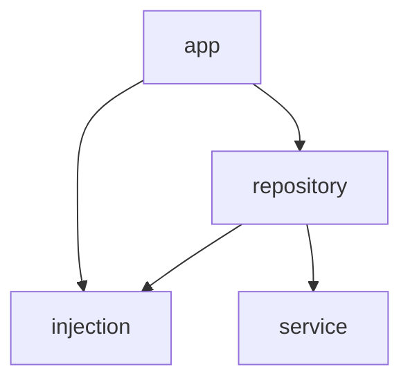

:::message
この記事は「[Flutter Advent Calendar 2024](https://qiita.com/advent-calendar/2024/flutter)」の 22 日目の記事です🎄

21 日目：[非同期初期化が必要なRiverpodプロバイダの初期化方法](https://zenn.dev/altiveinc/articles/riverpod-provider-initialization) by 村松龍之介さん
22 日目：[Pub workspaces を使ってみた](https://zenn.dev/kosukesaigusa/articles/dart-pub-workspaces) by [Kosuke Saigusa](https://x.com/KosukeSaigusa) ← 今ここ
23 日目：by [ひであ](https://qiita.com/hidea) さん
:::

## はじめに

今年のアドベントカレンダー期間中の 2024/12/12 に Flutter SDK 3.27.0 がリリースされました！

@[card](https://medium.com/flutter/whats-new-in-flutter-3-27-28341129570c)

https://x.com/FlutterDev/status/1866942284882747471

また、同梱される Dart SDK のバージョンが 3.6.0 になり、Pub workspaces (monorepos support) がサポートされるようになりました。

@[card](https://dart.dev/tools/pub/workspaces)

この記事では、上記のドキュメントに従って Pub workspaces を使ってみた内容をサンプルプロジェクトと一緒に紹介します。

## Pub workspaces (monorepos support) とは

Flutter や Dart のプロジェクトの開発をする際、複数の Flutter や Dart のパッケージを作成して、一緒にバージョンコントロールし、同一の GitHub リポジトリ、ローカルマシン上の同一ワークスペースとして開発することがあります。

- 社内に複数のプロジェクトやアプリケーションが存在し、その共通部分を切り出したい
- 単一のアプリケーションについても、各モジュール・レイヤー間の依存関係を厳密に定義したい
- riverpod, flutter_riverpod, flutter_hooks, riverpod_lint, ... のようなパッケージ開発において、各パッケージを並行して開発したい

などのモチベーションが考えられます。

以前にマルチパッケージを活用した Flutter のアーキテクチャについて過去の記事で紹介しましたので、よろしければ合わせてご覧ください：

https://zenn.dev/omiai_techblog/articles/omiai-flutter-architecture

このようなマルチパッケージ構成では、あるパッケージが他のパッケージに依存したり、各パッケージが同じ外部パッケージに依存したりすることがありますが、それらの依存関係が矛盾なく解決される必要があります。

また、本質的な問題でもありませんが、開発中に各パッケージが依存するパッケージに変更があった場合、複数パッケージそれぞれに対して `flutter pub get` や `dart pub get` を実行するのはやや面倒です。

そのため、マルチパッケージ・モノレポ構成での開発では、これまで Melos が広く使われてきました。

@[card](https://melos.invertase.dev/)

たとえば、本記事執筆時点の riverpod の GitHub リポジトリでも Melos が利用されています。

https://github.com/rrousselGit/riverpod

それに似た機能が Dart 公式でサポートされるようになったのが Pub workspaces です。

公式ドキュメントによると、エディタや IDE でマルチパッケージ構成のワークスペースを開く時、それぞれのパッケージに対して Dart analyzer が別々のコンテキストで動作することから
メモリ使用量が増加してしまう問題がありますが、Pub workspaces を利用することで解析に必要なメモリ量を削減し、パフォーマンスを向上させることもできるそうです。

## Pub workspaces (monorepos support) を利用する

Pub workspaces を利用するためには、リポジトリルートに `pubspec.yaml` を配置し、`workspace` に、ワークスペースとして扱いたいパッケージのパスを列挙します。

`melos.yaml` の `packages` 相当です。

Pub workspaces がサポートされる Dart SDK は 3.6.0 以上であることにも注意が必要です。

```yaml
name: _
publish_to: none
environment:
  sdk: ^3.6.0
workspace:
  - packages/package_a
  - packages/package_b
  - packages/package_c
```

ワークスペース内の各パッケージの `pubspec.yaml` には、`resolution: workspace` を設定します。

```yaml
environment:
  sdk: ^3.6.0
resolution: workspace
```

こうすることで、`dart (flutter) pub get` を実行した際に、下記が実行されます。

ワークスペース内のどのディレクトリで実行しても同様になります。

- プロジェクトルートの `pubspec.yaml` にある `workspace` に列挙されたパッケージの依存関係を解決した `pubspec.lock` を作成する
- プロジェクトルートの `.dart_tool/package_config.json` に、ワークスペース内のパッケージのパスとパッケージ名のマッピングを作成する
- プロジェクトルート以外のワークスペースの各パッケージの `pubspec.lock` と `.dart_tool/package_config.json` を削除する

Melos では、`melos bs` を実行すると、各パッケージの依存パッケージの解決が行われ、各パッケージに `pubspec.lock`, `.dart_tool/package_config.json` が作成されます。

また、Melos では、ワークスペース内の別のパッケージへの依存については、その参照先をローカルの相対パスで一時的に上書きするための `pubspec_overrides.yaml` も生成されます。

上記のような内容が、Pub workspaces と Melos との違いであると言えそうです。

また、Pub workspaces を利用する際、`dart pub add` や `dart pub publish` のようなコマンドは、それを実行しているディレクトリ下のパッケージについてのみ実行されます。

つまり、それらのコマンドを実行する際は `cd` コマンドでディレクトリを移動するか、または `-C` オプションでディレクトリを指定する必要があります。

```sh
# -C オプションで packages/package_a を指定して実行する。
dart pub -C packages/package_a publish

# または、cd コマンドで移動してから実行する。
cd packages/package_a
dart pub publish
```

## サンプルプロジェクト

Pub workspaces (monorepos support) を利用したサンプルプロジェクトとして、先日 Flutter 公式から公開された Architecting Flutter apps に似た構成のカウンターアプリを実装しました。

@[card](https://docs.flutter.dev/app-architecture)


本サンプルプロジェクトでは、下記のような構成で各レイヤーをパッケージに分けて実装しました。なお、Riverpod を利用するなど、実装方法については、私や皆さんが現場で利用することが多いであろう方法に合わせて Architecting Flutter apps から少し変更している部分があります。

内容としては、

- UI 上に現在のカウント値を表示し、カウントを増加させたり、クリアさせたりできる
- カウント値は Shared Preferences に永続化される

といった極めてシンプルなものです。

https://github.com/kosukesaigusa/pub-workspaces-sample


| パッケージ | 実装内容 |
| ---- | ---- |
| app | UI レイヤー（View と ViewModel）を実装する。 |
| repository | データソースとのやり取りを記述する。データソースの種類については app に表出させない。 |
| service | アプリケーションの最下層で、HTTP のエンドポイントやローカルファイルへのアクセスをラップする。 |
| injection | 依存性の注入を助ける。 |



### service パッケージ

`service` パッケージ は `shared_preferences` パッケージのみに依存します。

```yaml
environment:
  sdk: ^3.6.0
resolution: workspace

dependencies:
  shared_preferences: ^2.3.4
```

Shared Preferences をラップした `SharedPreferencesService` クラスを実装します。

```dart
import 'package:shared_preferences/shared_preferences.dart';

/// A service for shared preferences.
class SharedPreferencesService {
  /// Constructs a new [SharedPreferencesService].
  SharedPreferencesService(this._sharedPreferencesAsync);

  final SharedPreferencesAsync _sharedPreferencesAsync;

  /// Gets an integer from shared preferences.
  Future<int?> getInt(String key) => _sharedPreferencesAsync.getInt(key);

  /// Sets an integer in shared preferences.
  Future<void> setInt(String key, int value) async =>
      _sharedPreferencesAsync.setInt(key, value);

  /// Removes a key from shared preferences.
  Future<void> remove(String key) async => _sharedPreferencesAsync.remove(key);
}
```

### repository パッケージ

`repository` パッケージ は `injection` パッケージに依存し、`injection` パッケージのインターフェースを経由して `SharedPreferencesService` を利用します。

```yaml
environment:
  sdk: ^3.6.0
resolution: workspace

dependencies:
  freezed_annotation: ^2.4.4
  injection:
    path: ../injection
  riverpod: ^2.6.1
  riverpod_annotation: ^2.6.1
```

Architecting Flutter apps にならって、Repository メソッドの結果は `Result` 型相当のオブジェクトを返すようにして、Repository 層以下で発生する例外が、意図せず上層に表れないようにします。

```dart
import 'package:freezed_annotation/freezed_annotation.dart';

part 'result.freezed.dart';

/// A result of repository method.
@freezed
sealed class RepositoryResult<T> with _$RepositoryResult<T> {
  /// Constructs a [RepositoryResult] with success.
  const factory RepositoryResult.success(T data) = SuccessRepositoryResult<T>;

  /// Constructs a [RepositoryResult] with failure.
  const factory RepositoryResult.failure(Object e) = FailureRepositoryResult;
}
```

```dart
import 'package:injection/injection.dart';
import 'package:riverpod/riverpod.dart';
import 'package:riverpod_annotation/riverpod_annotation.dart';

import 'util/result.dart';

part 'count_repository.g.dart';

/// Provides a [CountRepository].
@riverpod
CountRepository countRepository(Ref ref) => CountRepository(ref);

/// A repository for counting.
class CountRepository {
  /// Constructs a [CountRepository].
  const CountRepository(this._ref);

  final Ref _ref;

  /// Fetches the current count.
  Future<RepositoryResult<int>> fetchCount() async {
    try {
      final count =
          await _ref.read(sharedPreferencesServiceProvider).getInt('count');
      return RepositoryResult.success(count ?? 0);
    } on Exception catch (e) {
      return RepositoryResult.failure(e);
    }
  }

  /// Saves the new count.
  Future<RepositoryResult<void>> saveCount(int count) async {
    try {
      await _ref.read(sharedPreferencesServiceProvider).setInt('count', count);
      return const RepositoryResult.success(null);
    } on Exception catch (e) {
      return RepositoryResult.failure(e);
    }
  }

  /// Clears the count.
  Future<RepositoryResult<void>> clearCount() async {
    try {
      await _ref.read(sharedPreferencesServiceProvider).remove('count');
      return const RepositoryResult.success(null);
    } on Exception catch (e) {
      return RepositoryResult.failure(e);
    }
  }
}
```

### injection パッケージ

`injection` パッケージは、Architecting Flutter apps には存在しないレイヤーですが、各パッケージ間の依存をより厳密に限定するために定義しています。

`service` パッケージや、`service` パッケージがラップする `shared_preferences` パッケージに依存し、それらの機能を利用するためのインターフェース定義や依存の注入を助ける実装を記述します。

```yaml
environment:
  sdk: ^3.6.0
resolution: workspace

dependencies:
  freezed_annotation: ^2.4.4
  meta: ^1.15.0
  riverpod: ^2.6.1
  riverpod_annotation: ^2.6.1
  service:
    path: ../service
  shared_preferences: ^2.3.4
```

`service` パッケージの `SharedPreferencesService` を利用するためのインターフェースを定義します。

`SharedPreferencesService` クラスのインスタンスを生成する関数も一緒に定義しておくことにしました。

```dart
import 'package:meta/meta.dart';
import 'package:riverpod/riverpod.dart';
import 'package:riverpod_annotation/riverpod_annotation.dart';
import 'package:service/service.dart';
import 'package:shared_preferences/shared_preferences.dart';

part 'shared_preferences.g.dart';

/// Provides a [SharedPreferencesService] instance.
@riverpod
SharedPreferencesService sharedPreferencesService(Ref ref) =>
    throw UnimplementedError();

/// Creates a [SharedPreferencesService] instance.
SharedPreferencesService getSharedPreferencesService({
  @visibleForTesting SharedPreferencesAsync? sharedPreferencesAsync,
}) =>
    SharedPreferencesService(
      sharedPreferencesAsync ?? SharedPreferencesAsync(),
    );
```

`app` パッケージの `ProviderScope` で Shared Preferences の挙動を上書きするための `List<Override>` も定義しておくことにしました。

このようにすることで、`app` パッケージが `shared_preferences` パッケージに直接依存することがなくなります。

```dart
import 'package:riverpod/riverpod.dart';

import 'shared_preferences.dart';

/// Get list of overrides for `ProviderScope`.
List<Override> getOverrides() => [
      sharedPreferencesServiceProvider
          .overrideWithValue(getSharedPreferencesService()),
    ];
```

### app パッケージ

app パッケージでは、`repository` パッケージを利用して ViewModel からデータソースにアクセスし、Riverpod を用いて状態管理と UI の体験を実装します。

```yaml
environment:
  sdk: ^3.6.0
resolution: workspace

dependencies:
  flutter:
    sdk: flutter
  flutter_riverpod: ^2.6.1
  injection:
    path: ../injection
  repository:
    path: ../repository
  riverpod_annotation: ^2.6.1
```

エントリポイントの `ProviderScope.overrides` で `injection` パッケージに定義した `getOverrides` 関数を利用します。

```dart
void main() {
  final overrides = getOverrides();
  runApp(
    ProviderScope(
      overrides: overrides,
      child: const MaterialApp(home: Counter()),
    ),
  );
}
```

View の実装は下記の通りです。

```dart
/// A counter screen.
class Counter extends ConsumerWidget {
  /// Constructs a [Counter].
  const Counter({super.key});

  @override
  Widget build(BuildContext context, WidgetRef ref) {
    final counter = ref.watch(counterViewModelProvider).valueOrNull ?? 0;
    return Scaffold(
      appBar: AppBar(title: const Text('Counter')),
      body: Center(
        child: Column(
          mainAxisAlignment: MainAxisAlignment.center,
          children: [
            Text('Counter: $counter'),
            const SizedBox(height: 32),
            ElevatedButton.icon(
              onPressed: () =>
                  ref.read(counterViewModelProvider.notifier).increment(),
              icon: const Icon(Icons.add),
              label: const Text('Increment'),
            ),
            const SizedBox(height: 32),
            ElevatedButton.icon(
              onPressed: () =>
                  ref.read(counterViewModelProvider.notifier).clear(),
              icon: const Icon(Icons.delete),
              label: const Text('Clear'),
            ),
          ],
        ),
      ),
    );
  }
}
```

ViewModel の実装は下記の通りです。

Riverpod の Notifier による実装を ViewModel とみなすことにしました。

```dart
import 'package:repository/repository.dart';
import 'package:riverpod_annotation/riverpod_annotation.dart';

part 'counter_view_model.g.dart';

/// A view model for the counter.
@riverpod
class CounterViewModel extends _$CounterViewModel {
  @override
  Future<int> build() async {
    final result = await ref.watch(countRepositoryProvider).fetchCount();
    switch (result) {
      case SuccessRepositoryResult(:final data):
        return data;
      case FailureRepositoryResult():
        return 0;
    }
  }

  /// Increments the count.
  ///
  /// Throws an [IncrementCounterException] if the count cannot be incremented.
  Future<void> increment() async {
    final count = state.valueOrNull ?? 0;
    final result = await ref.read(countRepositoryProvider).saveCount(count + 1);
    switch (result) {
      case SuccessRepositoryResult():
        ref.invalidate(countRepositoryProvider);
        return;
      case FailureRepositoryResult():
        throw IncrementCounterException();
    }
  }

  /// Clears the count.
  ///
  /// Throws a [ClearCounterException] if the count cannot be cleared.
  Future<void> clear() async {
    final result = await ref.read(countRepositoryProvider).clearCount();
    switch (result) {
      case SuccessRepositoryResult():
        ref.invalidate(countRepositoryProvider);
        return;
      case FailureRepositoryResult():
        throw ClearCounterException();
    }
  }
}
```

## Pub workspaces における依存関係の解決

上記の構成では、たとえば `shared_preferences` パッケージは `service` パッケージと `injection` パッケージの依存関係に表れています。

ためしに、片方を互換性のないバージョンにしてみます。

```yaml
dependencies:
  shared_preferences: ^0.5.13+2
```

そうすると、下記のように依存関係の解決に失敗します。

Pub workspaces (monorepos support) のドキュメントにも記述されている通り、ワークスペース内のパッケージ間に非互換性がある場合には、パッケージを使い始めるときではなく、`pubspec.yaml` を変更し、`dart pub get` を行った時点で依存関係の解決に失敗し、その時点で修正を行うことを強制してくれます。

```sh
$ dart pub get
Resolving dependencies... 
Because service depends on shared_preferences ^2.3.4 and injection depends on shared_preferences ^0.5.13+2, version solving failed.
Failed to update packages.
```

[Melos の Shared Dependencies](https://melos.invertase.dev/commands/bootstrap#shared-dependencies) 機能のように、ワークスペース内で共通して利用しているパッケージバージョンを、指定した内容で一括上書きするような機能はありません。

`dart pub get` を行い、ワークスペース内の依存関係の解決に成功した結果得られるプロジェクトルートの `pubspec.lock` と `.dart_tool/package_config.json` に、そのワークスペースに関する依存情報のすべてが集約されます。

## CI

`flutter (dart) pub get` を一度行うだけで、ワークスペース内の各パッケージの依存関係が解決されるので、Melos を利用する場合よりも少しだけ CI がシンプルになります。

サンプルプロジェクトにも小さなサンプルを用意したので、興味がある方は参考にしてください。

https://github.com/kosukesaigusa/pub-workspaces-sample/blob/b1136e10331b2ed6379dd8093f2b6df4bdf362cf/.github/actions/setup/action.yml#L48-L51

## その他

Melos では、[ドキュメント](https://melos.invertase.dev/) にたくさんの機能が紹介されているように、

- 各パッケージに対して同じコマンドを順次、または並行して実行するようなスクリプトを定義・実行できるようなタスクランナーのような機能
- 各コマンドを実行するパッケージを便利にフィルタする機能
- パッケージ開発者には嬉しい publish や version 関係のコマンド

などが多く提供されていますが、そのような機能は現在の Pub workspaces ではスコープ外です。

個人的には、Melos の機能を多く上手に使いこなしているプロジェクトでもなければ、タスクランナー相当の機能は Makefile 等で適当に補いつつ、今後は Dart 公式の Pub workspaces を利用するようにしていくようにして良さそうだと思いました。

## おわりに

この記事では、2024 年の Flutter アドベントカレンダーとして、ちょうどこの年末に発表された Dart の Pub workspaces について紹介しました。

ぜひ、みなさんの Flutter, Dart プロジェクトでも活用してみてください！

https://github.com/kosukesaigusa/pub-workspaces-sample
