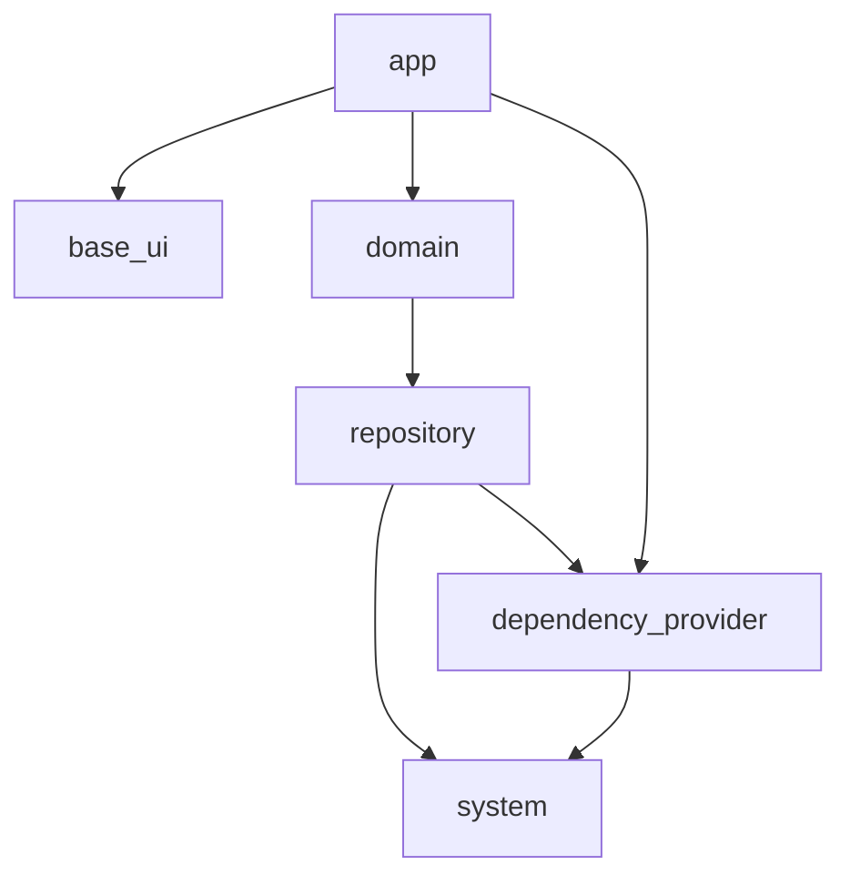

## この記事について

以前の「Omiai の Flutter プロジェクトのアーキテクチャ」という記事：

@[card](https://zenn.dev/kosukesaigusa/articles/omiai-flutter-architecture)

@[card](https://zenn.dev/kosukesaigusa/articles/omiai-flutter-architecture-system)

@[card](https://zenn.dev/kosukesaigusa/articles/omiai-flutter-architecture-repository)

の続編として、`domain` パッケージの具体的な実装内容について紹介します。

## domain パッケージ

Omiai の Flutter プロジェクトのパッケージ構成は下図の通りです。

`domain` パッケージでは、業務知識を表現するエンティティの定義や、業務ロジックの記述を行います。

クライアントアプリとして取り扱うべき例外を定義するのも `domain` パッケージの役割です。

以下で、具体的な実装内容やそのような実装にしている背景を説明します。

## 実装内容

### 業務知識を表現するエンティティの定義

### 業務ロジックの記述

## おわりに

この記事では、Omiai の Flutter プロジェクトのアーキテクチャ紹介の続編として、`domain` パッケージについて説明しました。

Omiai の Flutter プロジェクトへの参画にご興味のある方は、ぜひ一度お気軽にお問い合わせください！
