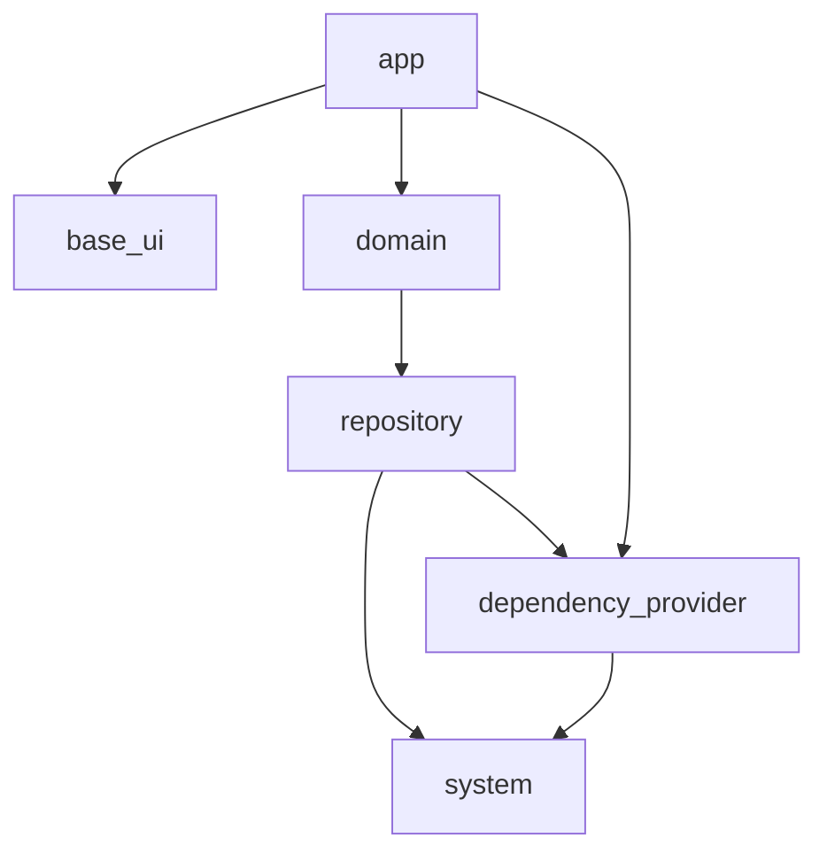

## この記事について

株式会社 Omiai の Flutter テックリードの [@kosukesaigusa](https://github.com/kosukesaigusa) です。

以前の「Omiai の Flutter プロジェクトのアーキテクチャ」という記事：

@[card](https://zenn.dev/kosukesaigusa/articles/omiai-flutter-architecture)

@[card](https://zenn.dev/kosukesaigusa/articles/omiai-flutter-architecture-system)

の続編として、`repository` パッケージの具体的な実装内容について紹介します。

## repository パッケージ

Omiai の Flutter プロジェクトのパッケージ構成は下図の通りです。

`repository` パッケージでは、データソース（自社の API サーバーやローカルストレージなど）とのやり取りを記述します。

`repository` パッケージを利用する側である `domain` パッケージにとっては、通信先が自社の API サーバーであるか、それともそれ以外の API サーバーなのか、またはローカルストレージなのかということは知る必要のないようにインターフェースを定義します。

また、`system` パッケージと同様に、例外をどのようにハンドリングするかということも、`repository` パッケージの広義のインターフェースという観点で重要です。

以下で具体的な実装内容やそのような実装にしている背景を説明します。

