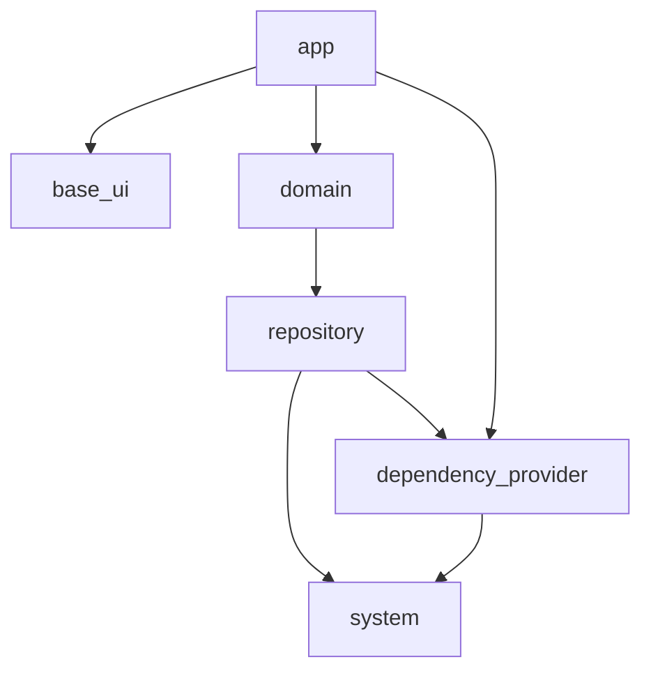

## この記事について

以前の「Omiai の Flutter プロジェクトのアーキテクチャ」という記事：

@[card](https://zenn.dev/kosukesaigusa/articles/omiai-flutter-architecture)

@[card](https://zenn.dev/kosukesaigusa/articles/omiai-flutter-architecture-system)

の続編として、`repository` パッケージの具体的な実装内容について紹介します。

## repository パッケージ

Omiai の Flutter プロジェクトのパッケージ構成は下図の通りです。



`repository` パッケージでは、データソース（自社の API サーバーやローカルストレージなど）とのやり取りを記述します。

`repository` パッケージを利用する側である `domain` パッケージにとっては、通信先が自社の API サーバーであるか、それともそれ以外の API サーバーなのか、またはローカルストレージなのかということは知る必要のないようにインターフェースを定義します。

また、`system` パッケージと同様に、例外をどのようにハンドリングするかということも、`repository` パッケージの広義のインターフェースという観点で重要です。

以下で具体的な実装内容やそのような実装にしている背景を説明します。

## 実装内容

`repository` パッケージでは、下記のような実装をします。

| 実装内容 | 詳細 |
| ---- | ---- |
| RepositoryResult | Repository による通信結果の成功・失敗を表現する sealed クラス |
| Dto | Domain Transfer Object の略で、Repository による通信結果の値を表現するクラス |
| Repository | 通信処理を記述するクラス |

## RepositoryResult の例

`RepositoryResult` は、Repository による通信結果の成功、失敗を freezed の sealed class で表現するクラスです。

[前回の system パッケージの記事](https://zenn.dev/kosukesaigusa/articles/omiai-flutter-architecture-system) で定義した `HTTPResponse` も同様に sealed class で定義しているのもあり、Repository による通信結果も同様に定義することにしています。

これにより、Repository のメソッドを呼び出す domain 層では、業務知識や仕様に従って通信結果の成功・失敗をハンドリングすることが強制されます。

```dart
import 'package:freezed_annotation/freezed_annotation.dart';

part 'result.freezed.dart';

/// リポジトリによる通信結果を表すクラス。
///
/// 成功の場合は [SuccessRepositoryResult]、失敗の場合は [FailureRepositoryResult] が使用される。
@freezed
sealed class RepositoryResult<T> with _$RepositoryResult<T> {
  /// 通信成功の Result を生成する。
  const factory RepositoryResult.success(T data) = SuccessRepositoryResult<T>;

  /// 通信失敗の Result を生成する。
  ///
  /// - [e] には、例外オブジェクトなどが与えられる。
  /// - [reason] には、任意で HTTP のステータスコードに対応する失敗理由が与えられる。
  /// - [errorDto] には、任意でエラーレスポンスのボディが与えられる。
  const factory RepositoryResult.failure(
    Object e, {
    FailureRepositoryResultReason? reason,
    ErrorDto? errorDto,
  }) = FailureRepositoryResult;
}

/// HTTP のステータスコードに対応する失敗理由を表す列挙型。
enum FailureRepositoryResultReason {
  /// 400 Bad Request.
  badRequest,
  
  /** 省略 */
  ;
}
```

## Dto の例

Dto では、HTTP レスポンスのインターフェース相当のデータ型を定義します。

Open API 仕様のドキュメントがあれば openapi_generator などで自動生成することもできるかもしれません。

しかし、Omiai では、長年の開発・運用の歴史から、サーバサイドの技術的負債も、特に API レスポンスの仕様には常に付きまとってきます。

freezed と json_serializable を用いて API レスポンスを基本的にはその仕様に忠実に表現したり、`JsonKey` を用いてフィールド名の変更や、各種の `JsonConverter` を利用して型の変換などを行ったりします。

```dart
@freezed
class FooDto with _$FooDto {
  const factory FooDto({
    // ...のID.
    required int someId,
    // ...のフィールド名。
    @JsonKey(name: 'inappropriate_field_name') required String someFieldName,
    // ...一覧。
    @Default([]) List<String> things,
    // ...かどうか。
    @flexibleBoolConverter required bool isSomething,
    // ...の日時。
    @flexibleDateTimeConverter required DateTime someDateTime,

  }) = _FooDto;

  factory FooDto.fromJson(Map<String, dynamic> json) => _$FooDtoFromJson(json);
}
```

Omiai ではサーバサイドもかなり古くから運用されており、様々な負債と言えるような内容が返ってくるものがあります。

それらを、下記のようにfreezed や json_annotation のアノテーションや自作の `JsonConverter` を使用して解消するようにしています。

実装自体は形式化されていて難しくありませんが、Flutter や Dart の世界に、サーバサイドの課題や負債を持ち込まない関所のような存在でもあります。

| 課題 | 解消策 |
| ---- | ---- |
| 不適切なフィールド名（型とフィールド名が一致していない、英語の誤りなど） | `@JsonKey(name: '...')` で命名を変更する |
| 配列要素の不要な optional（空配列として扱えば十分である場合） | `@Default([])` でデフォルト値を設定する |
| 真偽値フィールドが `"0"` や `"1"` の文字列で返される場合がある | 自作の `@flexibleBoolConverter` で変換する |
| ISO 8601 形式に従わない日時文字列 | 自作の `@flexibleDateTimeConverter` で変換する |

:::message
上記のようなサーバサイドの問題や負債を解消するための API 仕様の破壊的な変更も、プラットフォームごとにそれぞれ提供されている iOS, Android (,Web) のクライアントアプリが、実装内容やリリースのタイミングを合わせる必要があることも障壁となり、なかなか実施されてきませんでした。

シングルコードベースでクロスプラットフォームな開発を可能にする Flutter へのリプレイスは、このようなサーバサイドの問題解決にも後々効いてきます。
:::

## Repository の例

たとえば HTTP 通信を行う部分については、`system` で定義した `HttpClient` の `Unimplemented` なインターフェースを `dependency_provider` パッケージに定義しておいて、`repository` パッケージではそれを通じて HTTP 通信を行うようにします。

```dart
class FooTepository {
  const Repository(_this.ref);

  final Ref _ref;
}
```

## おわりに

この記事では、Omiai の Flutter プロジェクトのアーキテクチャ紹介の続編として、データソース（自社の API サーバーやローカルストレージなど）とのやり取りを記述する `repository` パッケージについて説明しました。

Omiai の Flutter プロジェクトへの参画にご興味のある方は、ぜひ一度お気軽にお問い合わせください！
