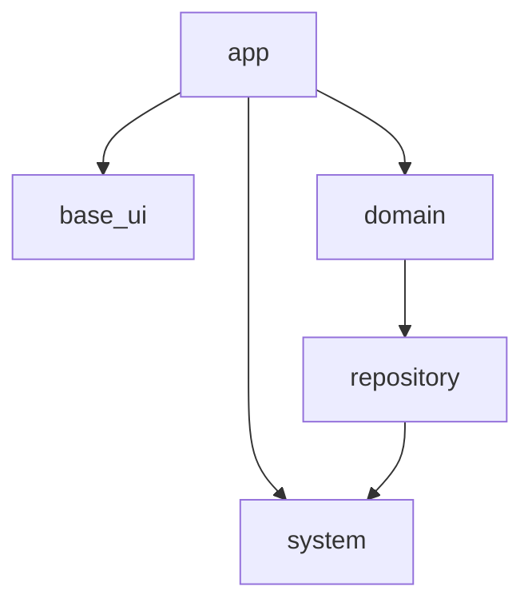

## この記事について

株式会社 Omiai の Flutter テックリードの [@kosukesaigusa](https://github.com/kosukesaigusa) です。

以前の「Omiai の Flutter プロジェクトのアーキテクチャ」という記事：

@[card](https://zenn.com/kosukesaigusa/articles/omiai-flutter-architecture)

の続編として、system パッケージの具体的な実装内容について紹介します。

## system パッケージ

Omiai の Flutter プロジェクトのパッケージ構成は下図の通りです。

:::message
system のパッケージ名は、それほど一般的または典型的ではないかもしれませんが、これまでに経験したプロジェクトを参考にしています。core, service, infrastructure のような命名もあり得るかもしれません。
:::

system パッケージでは、3rd パーティのツールをラップして腐敗防止層のような役割をしたり、その他の基礎的・汎用的な処理を記述したりします（例：HTTP クライアント、Shared Preferences, Firebase Analytics など）。

そうすることで、`system` よりも図の中で上側のパッケージでは、direct にそれらの 3rd パーティのツールに依存することがなくなります。

`system` パッケージとして提供する API のインターフェースを適切に定義することができていれば、実際にそうすることは多くはないでしょうが、利用するツールを同等の機能をもつ別のものに置換することも容易にできるようになります。

`system` パッケージは、定められたパッケージ以外には依存せず、アプリケーションの業務知識に依存するような命名やインターフェース定義にならないように注意します。

基本的には全く別のアプリケーションでもそのまま利用できるような内容になるべきです。

一方、3rd パーティのツールには、多様な用途に対応するために、様々な機能やインターフェースが提供されています。自身のプロジェクトでは明らかに不必要な機能やインターフェースは省略したり、アプリケーションの用途に沿うようにカスタマイズしたりすることもあるかもしれません。

また、例外をどのようにハンドリングするかということも、`system` パッケージの広義のインターフェースという観点で重要です。

以降で、`system` パッケージの具体的な実装内容について紹介します。

