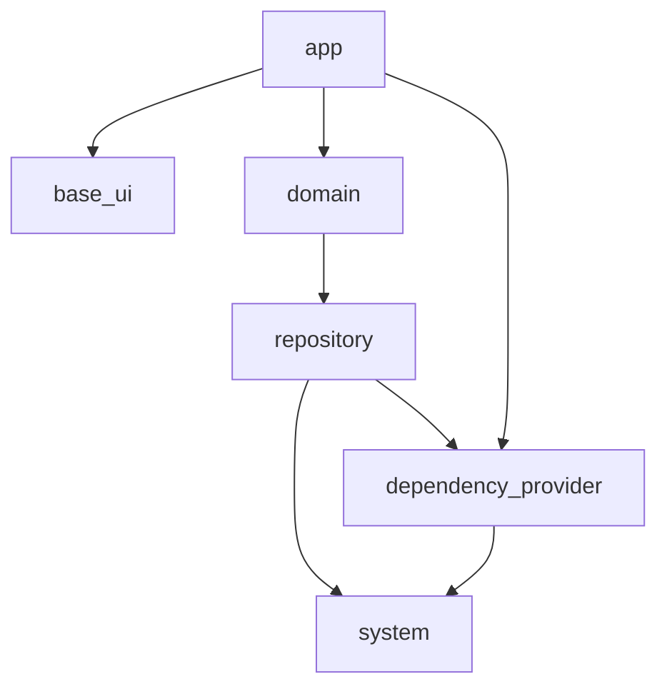

## この記事について

株式会社 Omiai の Flutter テックリードの [@kosukesaigusa](https://github.com/kosukesaigusa) です。

以前の「Omiai の Flutter プロジェクトのアーキテクチャ」という記事：

@[card](https://zenn.dev/kosukesaigusa/articles/omiai-flutter-architecture)

の続編として、system パッケージの具体的な実装内容について紹介します。

## system パッケージ

Omiai の Flutter プロジェクトのパッケージ構成は下図の通りです。



:::message
system のパッケージ名は、それほど一般的または典型的ではないかもしれませんが、これまでに経験したプロジェクトを参考にしています。core, service, infrastructure のような命名もあり得るかもしれません。
:::

system パッケージでは、3rd パーティのツールをラップして腐敗防止層のような役割をしたり、その他の基礎的・汎用的な処理を記述したりします（例：HTTP クライアント、Shared Preferences, Firebase Analytics など）。

そうすることで、`system` よりも図の中で上側のパッケージでは、direct にそれらの 3rd パーティのツールに依存することがなくなります。

`system` パッケージとして提供する API のインターフェースを適切に定義することができていれば、実際にそうすることは多くはないでしょうが、利用するツールを同等の機能をもつ別のものに置換することも容易にできるようになります。

`system` パッケージは、定められたパッケージ以外には依存せず、アプリケーションの業務知識に依存するような命名やインターフェース定義にならないように注意します。

基本的には全く別のアプリケーションでもそのまま利用できるような内容になるべきです。

一方、3rd パーティのツールには、多様な用途に対応するために、様々な機能やインターフェースが提供されています。自身のプロジェクトでは明らかに不必要な機能やインターフェースは省略したり、アプリケーションの用途に沿うようにカスタマイズしたりすることもあるかもしれません。

また、例外をどのようにハンドリングするかということも、`system` パッケージの広義のインターフェースという観点で重要です。

以下で具体的な実装内容やそのような実装にしている背景を説明します。

## Firebase Analytics の例

下記は `firebase_analytics` パッケージの `FirebaseAnalytics` クラスをほとんどラップしただけのクラスです。

doc comment の内容とも重複しますが、下記のような工夫をしています。

- `system` パッケージ以外が `firebase_analytics` パッケージに直接依存しないようにする
- 分析ログの送信という性質上、利用する側に `await` させず、例外ハンドリングもさせない（例外が起きても呼び出し側の処理を止めない）ようにする
- `FirebaseAnalytics` クラスの各メソッドの現状利用する予定がない引数を利用できないようにする
- 一種の腐敗防止層としての実装とする

```dart
import 'dart:async';

import 'package:firebase_analytics/firebase_analytics.dart';
import 'package:util/util.dart';

/// firebase_analytics パッケージが提供する、Firebase Analytics の各機能をラップしたクラス。
///
/// ほとんど firebase_analytics のインターフェースの再実装のような内容になっているが、
///
/// - system パッケージ以外が firebase_analytics パッケージに直接依存しないようにする
/// - 分析ログの送信という性質上、利用する側に await させず、例外ハンドリングもさせない（例外が
/// 起きても呼び出し側の処理を止めない）ようにする
/// - [FirebaseAnalytics] クラスの各メソッドの現状利用する予定がない引数を利用できないようにする
/// - 一種の腐敗防止層としての実装とする
///
/// ことなどを目的としている。
class FirebaseAnalyticsClient {
  /// [FirebaseAnalyticsClient] を生成する。
  const FirebaseAnalyticsClient(this._firebaseAnalytics);

  final FirebaseAnalytics _firebaseAnalytics;

  /// Firebase Analytics にログを送信する。
  ///
  /// 本メソッドの返り値方は `void` で定義されており、[unawaited] で [_logEvent] を呼び
  /// 出すことで、もし例外が発生しても呼び出し側の処理を止めない（ただし、グローバルエラー
  /// ハンドラーを定義すればキャッチできる）ようにしている。
  void logEvent({
    required String name,
    required Map<String, Object>? parameters,
  }) =>
      unawaited(_logEvent(name: name, parameters: parameters));

  /// [FirebaseAnalytics.logEvent] メソッドを呼び出す。
  ///
  /// ログインイベントの送信時に何らかの例外やエラーが発生したらログ出力する。
  Future<void> _logEvent({
    required String name,
    required Map<String, Object>? parameters,
  }) async {
    try {
      // NOTE: callOptions の引数は現状利用する予定がないため、インターフェースに表していない。
      await _firebaseAnalytics.logEvent(name: name, parameters: parameters);
    }
    // NOTE: 上記の処理が何らかの例外やエラーが発生したらそれをログ出力できるように、あえて
    // 例外・エラー型を指定せずに catch (e) としている。
    // ignore: avoid_catches_without_on_clauses
    catch (e) {
      logger.e('Failed to log Firebase Analytics event: $e');
    }
  }

  /// Firebase Analytics のユーザー属性を設定する。
  ///
  /// 本メソッドの返り値方は `void` で定義されており、[unawaited] で [_setUserProperty]
  /// を呼び出すことで、もし例外が発生しても呼び出し側の処理を止めない（ただし、グローバルエラー
  /// ハンドラーを定義すればキャッチできる）ようにしている。
  void setUserProperty({required String name, required String value}) =>
      unawaited(_setUserProperty(name: name, value: value));

  /// [FirebaseAnalytics.setUserProperty] メソッドを呼び出す。
  ///
  /// ユーザー属性の設定時に何らかの例外やエラーが発生したらログ出力する。
  Future<void> _setUserProperty({
    required String name,
    required String value,
  }) async {
    try {
      // NOTE: callOptions の引数は現状利用する予定がないため、インターフェースに表していない。
      await _firebaseAnalytics.setUserProperty(name: name, value: value);
    }
    // NOTE: 上記の処理が何らかの例外やエラーが発生したらそれをログ出力できるように、あえて
    // 例外・エラー型を指定せずに catch (e) としている。
    // ignore: avoid_catches_without_on_clauses
    catch (e) {
      logger.e('Failed to set Firebase Analytics user property: $e');
    }
  }
}
```

