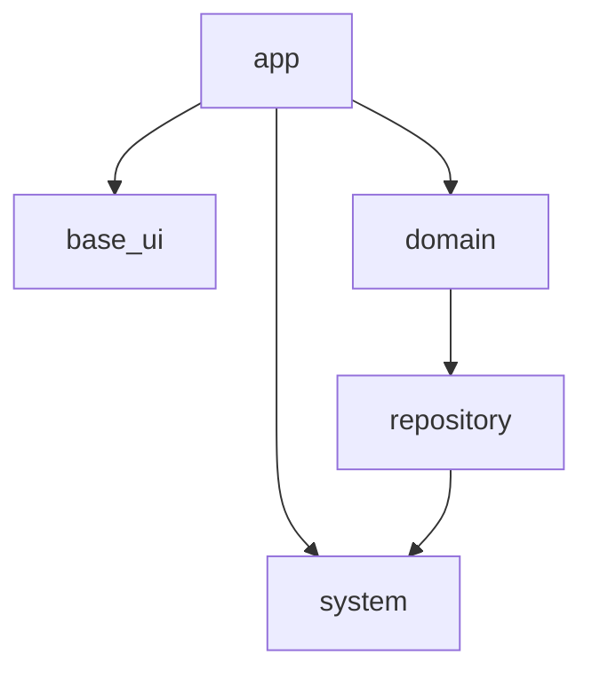

## はじめに

株式会社 Omiai の Flutter テックリードの [@kosukesaigusa](https://github.com/kosukesaigusa) です。

株式会社 Omiai では、マッチングアプリの Omiai を、長年の間 iOS, Android (, Web) それぞれのプラットフォームで開発・運営してきています。

... 年のサービス提供開始からの長い歴史の中で、多くのユーザーに利用していただいているサービスになっている一方で、コードベースはかなり古くなり、技術的な負債や、それぞれのプラットフォーム間の仕様の差異など、多くの課題が蓄積してきました。

そこで、Flutter を新規導入することを決定し、既存の  iOS, Android (, Web) アプリを Flutter で少しずつリプレイスしていくプロジェクトが 2024 年 5 月頃から始まりました。

これから Omiai の Flutter プロジェクトにおける様々な取り組みを紹介していきます。

## この記事について

Omiai の Flutter プロジェクトを紹介する最初の記事として、ここでは、Omiai の Flutter プロジェクトのアーキテクチャの概要を紹介します。

※ この記事では、プロジェクト構成、採用するパッケージ、技術スタックなども含めて、広義に「アーキテクチャ」と表現している場合があります。

## アーキテクチャ策定の目的

文字通り、ゼロから Flutter プロジェクトを開始し、そのアーキテクチャを策定するにあたり、まずは以下のような目的を定めました。

既存の  iOS, Android (, Web) アプリを Flutter でリプレイスしていくことに投資することを決断した目的に沿ったものである必要があります。

定量目標の例：

- 〇〇 サイズの「典型的な実装タスク」は、 N 日以内に実装を完了し、QA Ready の状態になる
- 〇〇 サイズの「典型的な修正タスク」は、N 日以内に実装を完了し、QA Ready の状態になる
- 例えば現状「（ざっくり）N 人日くらいかな（根拠は過去の経験）」と見積もっている実装タスクを、下記のような根拠と具体度とともに、見積もりおよびタスク分解できる
  - repository パッケージに、新たに X 個の API エンドポイントと通信する Repository の実装が必要
  - domain パッケージに、Y 個の新規実装（業務概念の定義や `Notifier`, `UseCase` の実装）が必要
  - app パッケージに、Z 個の UI 部品の実装が必要
  - よって、repository, domain, app の順で、それぞれ x, y, z 個の PR を作成する計画で、それぞれ, a, b, c 日ずつかかると見積もれる
- 業務概念や業務ロジックを実装する層 (domain) と、それより抽象的な層（repository, system など）全てで、ユニットテストをカバレッジ 100% で記述できる（それを前提に上記の見積もりができる）
- 新規参画者が N 日以内にアーキテクチャを理解可能で、タスクに着手することが可能

定性目標の例：

- 特に domain パッケージのソースコードは、「実行可能な仕様」と呼べるレベルで記述できる
- Flutter コミュニティの潮流を取り入れて、エンジニアにとって一定以上魅力的なアーキテクチャ策定、ライブラリ選定がされる

:::message

- 「典型的な実装タスク」は、プロダクトやサーバサイドの要件や仕様がどのくらい固まっているか、基盤のような実装の追加や変更の必要性やその具合、その他の技術的な不確実性などにも言及して、別途定義しています。
- 「〇〇 サイズ」「N 日以内」などは、記事で紹介するにはやや具体的過ぎるので省略しました
- app, domain, repository などのパッケージ名は以下で説明します

:::

## アーキテクチャ

プロジェクトの構成について考える時、Layer ファーストか Feature ファーストかといった観点があります。

Omiai の Flutter プロジェクトでは、まずは Layer の違いを強く意識してパッケージ自体を分離し、各 Layer においては、いわゆる Feature ごとのような方法でディレクトリを分離する方法を採用しました。

大きくは、以下のような方法でパッケージを分類しています。

命名はこれまで経験したり、見たりしてきたプロジェクトを参考に、既存メンバーにも違和感のないものにしています。

| パッケージ | 説明 |
| ---- | ---- |
| app | プレゼンテーション層。また、Flutter アプリのエントリポイントおよび、モバイルアプリ特有な実装などを記述する |
| base_ui | app で共通して使用する テキストスタイル、色、画像などの基礎的・原始的な UI 部品、それらを組み合わせた共通の UI 部品などを実装する。また、アイコンや画像などのアセットを管理する |
| domain | 業務知識や業務ロジックを記述する |
| repository | データソース（自社の API サーバーやローカルストレージなど）とのやり取りを記述する |
| system | 3rd パーティのライブラリをラップして腐敗防止層のような役割をしたり、その他の基礎的・汎用的な処理を記述したりする（例：HTTP クライアント、Shared Preferences, 分析ツールなど） |

:::message
実際には他にも、ロギングなどの全パッケージ共通で利用する汎用的な実装を記述する `util` パッケージや、repository 層で API サーバとの通信時に利用したい認証情報などのインターフェースを定義し、app パッケージで注入できるようにする dependency_provider と命名したパッケージなども存在します。
:::

## パッケージを分離する

それぞれのパッケージが許す依存の向きを簡略化して表すと下図の通りです。

:::message
app → system への依存は、例えば、エントリポイント内の処理で FLAVOR 等の環境に応じた HTTP クライアントや Shared Preferences のインスタンスを生成し、Unimplemented なインターフェースのみを提供する Repository の `Provider` を Riverpod の `ProviderScope.overrides` で上書きすることで、アプリの実行時の振る舞いを定義する目的などで定義しています。app → system の直接的な依存を避けたければ、それらをラップした依存性の注入のための別のパッケージを定義することも考えられるかもしれません。
:::

パッケージを分離し、依存を許可するパッケージの関係を厳密に定義することで、各パッケージの責務を明確にして、パッケージ間の結合を疎にし、依存を間違えた実装を防ぐことができます。

これまで経験してきたプロジェクトでも目にしてきた、下記のような課題を解決しようとしています。

もしかしたら、この記事を読んでくださっている方の中にも、まさに同様の課題に直面している方がいるかもしれません。

- 特に多くの箇所から利用される基盤のような実装が、依存して良い相手を誤ることで負債化し、修正を試みても影響範囲が大きいため修正困難な状況に陥る
- 本来許されない、または不要なはずのモジュールに依存した実装に対して、ユニットテストを書いたりメンテナンスしたりするコストが高くなる
- 中長期的に、習熟度や技術的なバックグランドに違いがあるメンバーが入れ替わったり、メンバーが増えたりする中で、当初はコード規約やプロジェクトの歴史に詳しい人物による PR レビューで防いでいたような誤った実装が、いつの間にか許されるようになってしまって、ルールが崩壊・形骸化する
- 上記のような課題が蓄積されたコードベースでは、新たな実装や既存実装の変更をするたびに、本来確認する必要のないはずのコンテキストや影響範囲の調査を強いられたり（そして、実行してみないとその調査結果に確信を持つのが難しい場合も多い）、ユニットテストが充実していない既存実装を変更するのに怖怖としたりする。結果、本来行うべき実装や変更に集中できず、開発生産性が上がらない

## Flutter の世界と Dart の世界

他にも、下記のような「Flutter か Dart か」という観点や、依存するパッケージの例を整理すると下表のようになります。

| パッケージ | Flutter か Dart か | （直接的に）依存するパッケージの例 |
| ---- | ---- | ---- |
| app | Flutter | • domain   • base_ui   • hooks_riverpod   • auto_route |
| base_ui | Flutter | • extended_image   • flutter_gen_runner   • flutter_svg |
| domain | Dart | • repository   • riverpod |
| repository | Dart | • system   • riverpod |
| system | Dart | • dio   • shared_preferences |

「Flutter か Dart か」というのは、ざっくり言うと「Flutter か Dart かどちらの世界を意識するべきパッケージか」を表しています。

repository は SharedPreferences に、system は Firebase などに依存するので、「Dart の世界」ばかりを意識するはずの domain パッケージや repository パッケージも、transitive には Flutter に依存しますが、direct には依存しません。

たとえば、Dart の世界であるはずのモデルクラスのメソッドの引数として、Flutter の世界の `BuildContext` 型が定義されているような例を見かけたことがある方もいるかもしれません（基本的な間違いのようにも思いますが、昔の手探りで Flutter を始めたプロジェクトでは見かけることもよくあります）。

Omiai 社内の Flutter 経験のないエンジニア（iOS やサーバサイドのエンジニア）で、Flutter のプロジェクトにも挑戦してもらうことになるメンバーに説明してみると、

> ウィジェットの組み方やウィジェットツリーの概念に習熟しないうちは、app や base_ui の実装に慣れるには時間がかかりそうだが、domain や repository の実装については、Dart 言語や、必要最低限の Riverpod の書き方や知識にさえキャッチアップすれば、比較的スムーズに開発に参画できそう

といった趣旨のフィードバックも得られました。

「いま自分は Flutter エンジニアとしてコードを書いているのか、Dart エンジニアとしてコードを書いているのか」という意識は重要です。

Omiai の Flutter プロジェクトでは、状態管理や依存性の注入のために Riverpod をフル活用していますが、それぞれのパッケージで、Flutter の世界である hooks_riverpod (flutter_riverpod) に依存するか、Dart の世界である riverpod に依存するかを区別しているのも小さなこだわりです。
